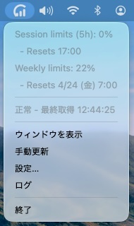

# ClaudeUsageMonitor

Claude のセッション使用率・週次/月次使用率・リセット時刻を表示、JSON として出力、外部 API に送信できる macOS メニューバー常駐アプリ。Individual（Pro / Max）、Enterprise の各プランに対応。



## 主要機能

### メニューバー常駐・状態表示

- Dock には出ず、メニューバーにアイコンを常駐
- アイコンの色（Normal / Orange / Red）で最新の取得状態と使用率警告を判別
- メニューに使用率サマリ（セッション使用率・セッションリセット時刻・週次/月次使用率・リセット時刻）を常時表示

### モニタリング

- 設定した間隔でセッション使用率・週次/月次使用率・リセット時刻を取得
- （optional）取得データを JSON として `$TMPDIR` に保存
- （optional）取得データを設定した API エンドポイントに POST

### 使用率警告

- セッション使用率または週次/月次使用率が設定した警告閾値（デフォルト 90%）以上になるとメニューバーアイコンが Orange に変化
- Orange への遷移時に macOS のユーザー通知が発火
- 閾値未満に戻り再度到達した場合はまた通知される（遷移検知ベース）
- 通知の ON / OFF は macOS の「システム設定 → 通知 → ClaudeUsageMonitor」から操作

### OAuth ログイン対応

- Google ログインなど外部 OAuth プロバイダのポップアップに対応
- ポップアップを閉じた際にメインの表示を設定 URL に自動遷移

### 耐障害性

- `login` ⇄ `logout` のリダイレクトループを 5 秒以内に検出したら自動でセッションクリア＆リロード
- データ取得失敗が連続した場合、設定 URL に自動リロード

## 動作要件

- macOS 15 以降
- 依存ライブラリなし（標準フレームワークのみで動作）

## ビルド方法

1. このリポジトリを clone する
2. `ClaudeUsageMonitor.xcodeproj` を Xcode で開く
3. Signing & Capabilities タブで自分の Team を選択
4. Run ボタン（Cmd+R）でビルド・起動

## 使い方

### 起動時の挙動

- Dock アイコンや Cmd+Tab のアプリ一覧には出ない
- メニューバーにシルエットアイコン（Normal / Orange / Red）のみが表示される
- ブラウザ は内部で読み込まれるがウィンドウは出ない
- 初回起動後は claude.ai へのログインだけで Normal になる
- 最初の起動時は Red（取得待機中）。ログインと `/settings/usage` への到達を済ませると Normal に変わる
- 初回起動時に macOS から通知許可ダイアログが一度だけ表示される（後から「システム設定 → 通知 → ClaudeUsageMonitor」で変更可能）

### メニュー項目

メニュー先頭には使用率サマリが常時表示される（取得前・取得失敗時は `---` ）。表示行はプランによって変わる。

**Individual（Pro / Max）**

| 項目 | 説明 |
|------|------|
| `Session limits (5h): N%` | 現在のセッション使用率 |
| `  - Resets H:mm` | セッションのリセット時刻（JST） |
| `Weekly limits: N%` | 現在の週次使用率 |
| `  - Resets M/d (曜) H:mm` | 週次のリセット時刻（JST） |

**Enterprise**

| 項目 | 説明 |
|------|------|
| `Monthly limits: N%` | 現在の月次使用率 |
| `  - Resets M/d (曜) H:mm` | 月次のリセット時刻（JST） |

**操作項目（共通）**

| 項目 | 説明 |
|------|------|
| 状態ラベル | 現在の状態を文言で表示 |
| ウィンドウを表示 | ブラウザ を載せたウィンドウを画面中央に前面表示 |
| 手動更新 |即時データを取り直す（次回自動取得も手動更新時点から設定間隔後にリセットされる） |
| 設定… | 設定ウィンドウを開く（Cmd+, でも開ける） |
| ログ | 動作ログウィンドウを開く |
| 終了 | プロセス終了 |

ウィンドウはリサイズ可能。閉じた後に再度「ウィンドウを表示」で開き直しても前回のリサイズ済みサイズは保持される（ただし中央への再配置は行われる）。

### 初回ログイン手順

1. メニューから「ウィンドウを表示」を選択
2. 表示された claude.ai サイトにログイン（Google 等 OAuth も可）
3. claude.ai サイトへのログインが成功したことを確認し、ログインウインドウを [x] ボタンで閉じる
4. 使用量データ取得に成功した時点でアイコンが Normal に変われば成功

## 状態表示

メニューバーアイコンは Normal / Orange / Red の 3 値。

### Normal 条件（両方を満たす場合のみ）
1. 現在表示している URL が設定 URL と一致
2. 起動以降に少なくとも 1 回の取得が成功している
3. セッション使用率・週次/月次使用率のいずれも警告閾値未満

Normal 時のアイコンは macOS のメニューバー色に自動追従する（ダークモード / ライトモードでそれぞれ見やすい色になる）。

### Orange 条件
- Normal 成立時（取得成功）かつ、セッション使用率または週次/月次使用率のいずれかが**警告閾値（デフォルト 90%）以上**

Orange へ遷移した瞬間に macOS のユーザー通知（`Claude Usage Warning`）が 1 回だけ発火する。

### Red 条件

| 状態 | 文言 |
|------|------|
| 起動直後で一度も成功していない | `取得待機中` |
| URL 未設定 | `異常 - URL 未設定` |
| URL 設定済みだが現在のページが不一致（未ログイン等） | `異常 - ページを確認してください` |
| 直近の取得が失敗 | `異常 - 取得失敗 (n/3)` |
| 成功時 | `正常 - 最終取得 HH:mm:ss` |

「失敗」には JS 実行エラー・API レスポンスのタイムアウト（10 秒以内に `/usage` API の応答が届かない場合）・プラン判定不能・JSON パース失敗・ファイル書き込み失敗・API POST 失敗（HTTP 非 200 系・通信エラー）などを含む。API エンドポイント URL 未設定やファイル名未設定は skip 扱いで失敗にはカウントしない。

## ログ機能

メニューの「ログ」から動作ログウィンドウを開ける。以下が主な記録内容（INFO 以上）。

- アプリ起動、URL ロード、ページ読み込み完了
- 手動更新発火、セッションクリア実行
- fetch 成功時のセッション / 週次・月次使用率とリセット時刻サマリ
- status 遷移（遷移前後と Fetch / API / JSON の結果サマリ）
- 設定画面の各フィールド変更（Save / Cancel ボタン操作や取得処理の内部詳細は DEBUG）
- ログイン時起動の切替（`ログイン時起動: 有効化 / 無効化`。切替失敗時は WARN）
- OAuth ポップアップの生成と閉じ
- 使用率警告通知の送信（`通知送信: Claude Usage Warning ...`。送信失敗時は WARN）
- fetch 失敗・API POST 失敗（WARN）、3 連続失敗時の自動リロード・ループ検出によるセッションクリア（ERROR）

### 記録フォーマット

`NNNNN  HH:mm:ss [LEVEL]  message` の等幅フォーマット（`NNNNN` は起動後からの絶対行番号）。ウィンドウ上部には現在行数と上限（`N / 1000 行`）を表示し、「クリア」ボタンで全消去＆行番号リセットできる。

### ログレベル

`DEBUG` / `INFO` / `WARN` / `ERROR` の 4 段階。最大 1000 行の FIFO バッファで、古いものから破棄される。通常運用は `INFO` 以上のみ保持（デフォルト）。内部イベント（タイマー発火・ウィンドウ show/hide・細かいフィールド差分など）を追う必要がある場合の切り替え手順は [DEVELOPMENT.md](docs/DEVELOPMENT.md) を参照。

## 設定項目

メニューの「設定…」または Cmd+, で設定画面を開く。

| 項目 | 説明 |
|------|------|
| URL | 監視対象 URL（デフォルト `https://claude.ai/settings/usage`） |
| 実行間隔 | 秒単位（10〜86400 秒、10 秒刻み、初期値 300 秒） |
| APIエンドポイントURL | JSON を POST する先の URL（空にすると POST 無効） |
| モニタリング用JSONファイル名 | `$TMPDIR` に保存するファイル名（空にすると保存無効） |
| 警告閾値 | セッション / 週次・月次使用率がこの値以上でアイコンが Orange になる（1〜100%、1% 刻み、初期値 90%） |

入力値は編集バッファに保持され、「Save」ボタンで一括保存される（Cmd+Return）。「Cancel」ボタン（Esc）で破棄して閉じる。

設定画面の Save / Cancel 行より下には、Save / Cancel とは独立した即時実行ボタンが並ぶ:

- **「ログイン時に起動する」/「ログイン時の起動を無効にする」ボタン**: macOS のログイン項目に登録/解除する。操作は即時反映で Save 不要。現在の登録状態によってラベルが切り替わる。初回登録時は macOS のシステム設定で承認を促されることがある。ON/OFF 状態は「システム設定 → 一般 → ログイン項目」でも管理可能
- **「セッションをクリアして再読み込み」ボタン**: クッキー等を全削除して手動リセットする

## 出力形式

`$TMPDIR/<設定ファイル名>` および API エンドポイントへの POST ボディに以下の形式の JSON を出力。

```json
{
  "datetime": "2026-04-18 21:00:00",
  "plan": "individual",
  "session_pct": 42,
  "session_reset_at": "2026-04-18 23:00:00",
  "weekly_pct": 71,
  "weekly_reset_at": "2026-04-25 04:00:00"
}
```

キーはアルファベット順でソート済み。全時刻は JST（Asia/Tokyo）固定。`datetime` は計測時刻、`*_pct` は使用率（整数%）、`*_reset_at` はリセット時刻（時間単位に四捨五入）。

### `plan` フィールド

| 値 | 意味 |
|------|------|
| `"individual"` | 個人プラン（Pro / Max）。`session_*` は 5 時間ウィンドウ、`weekly_*` は 7 日ウィンドウに対応 |
| `"enterprise"` | Enterprise プラン。`session_*` が月次使用率 + 月次リセット、`weekly_*` は常に `null` |

### `null` になり得るフィールド

- **Enterprise プラン**: `weekly_pct` / `weekly_reset_at` は常に `null`。`session_reset_at` には JST の月次リセット日時が入る
- **Individual プラン**: サーバ側で `five_hour` / `seven_day` の片側が未集計の場合、該当する `session_*` / `weekly_*` がそれぞれ `null` になる
- **リセット時刻のみ `null`**: 使用率 0% 時などで `*_reset_at` だけが `null` になることがある

キーは `null` の場合も必ず出力される（省略されない）。

## 詳細

開発者向けの詳細情報（アーキテクチャ、設計判断、外部依存箇所、過去の不具合と対応など）は [DEVELOPMENT.md](docs/DEVELOPMENT.md) 参照。

## License

MIT License. See [LICENSE](LICENSE) for details.
